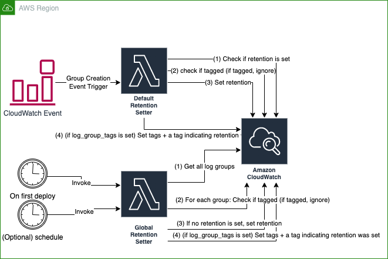

# Introduction
`terraform-aws-default-log-retention` is a Terraform module that will set default retention periods on all CloudWatch Log Groups in a region.

By default, AWS does not set a default retention on Log Groups, meaning that any logs emitted today are kept forever. This module aims to solve that in an automated fashion, rather than requiring you to set retention on all Log Groups yourself.

# Detail
It behaves in 2 ways:
* A one-time run which sets retention for all existing log groups ("Global Retention Setter" in diagram below)
* Event-driven based on CloudWatch Log Group creation events. Sets retention on the group.

If `log_group_tags` is set, the module will also set a `retention`=`Set by AWS Default Log Retention project.` tag on any group it touches, to make the changes seem less "magical" to end-users.

## Notes
* Neither Lambda will override existing retention schedules (non-zero) set by product teams.
* Neither Lambda will override groups that already have a `retention` tag

# Diagram



# Example Usage
## Single Region
```terraform
locals {
 notification_list               = ["your.email@example.com"]
 global_log_retention_run_period = 60 * 12 # Twice a day
 log_retention_in_days           = 30 # See tf-inputs.tf for allowed values
 log_retention_name              = "default-log-retention"
}

module "log_retention" {
  source = "git::https://github.com/StateFarmIns/terraform-aws-default-log-retention.git"

  name = local.log_retention_name

  log_level                       = "info"
  log_retention_in_days           = local.log_retention_in_days
  global_log_retention_run_period = local.global_log_retention_run_period

  alarm_configuration = {
    email_notification_list = local.notification_list
  }
}
```


## Multi-region
```
# Define an aws provider for your primary region, and an aliased "secondary" provider for the secondary region

locals {
 notification_list               = ["your.email@example.com"]
 global_log_retention_run_period = 60 * 12 # Twice a day
 log_retention_in_days           = 30 # See tf-inputs.tf for allowed values
 log_retention_name              = "default-log-retention"
}

module "log_retention" {
  source = "git::https://github.com/StateFarmIns/terraform-aws-default-log-retention.git"

  name = local.log_retention_name

  log_level                       = "info"
  log_retention_in_days           = local.log_retention_in_days
  global_log_retention_run_period = local.global_log_retention_run_period

  alarm_configuration = {
    email_notification_list = local.notification_list
  }
}

module "log_retention_secondary" {
  source = "git::https://github.com/StateFarmIns/terraform-aws-default-log-retention.git"

  providers = {
    aws = aws.secondary
  }

   name = local.log_retention_name

  log_level                       = "info"
  log_retention_in_days           = local.log_retention_in_days
  global_log_retention_run_period = local.global_log_retention_run_period

  alarm_configuration = {
    email_notification_list = local.notification_list
  }
  
  iam_role_suffix = "-secondary" # Required to prevent IAM role names from conflicting
}
```

The module assumes that you are using [AWS provider default tags](https://www.hashicorp.com/blog/default-tags-in-the-terraform-aws-provider), which implicitly adds all of your common tags to all resources. If you can't use `default_tags`, pass in the `tags` variable to the module.

# CloudWatch Metrics
This module emits CloudWatch Metrics. The metric namespace can be overridden by using the `metric_namespace` variable. The default metric namespace is `LogRetention`.

|Metric Name|Useful Statistic|Emitted by Global Lambda|Emitted by Event Lambda|Description|
|--|--|--|--|--|
|Total|Sum|✅|❌|Total number of CloudWatch Log Groups present in the region.|
|Updated|Sum|✅|✅|Number of CloudWatch Log Groups updated with retention by the module.|
|AlreadyHasRetention|Sum|✅|✅|Number of CloudWatch Log Groups that have a nonzero retention value already.|
|AlreadyTaggedWithRetention|Sum|✅|✅|Number of CloudWatch Log Groups that have `0` retention set but are tagged with `retention`. These groups are ignored by the module.|
|Errored|Sum|✅|❌|Number of CloudWatch Log Group updates which encountered an error. The Global setter will report errors and keep working on the remaining groups.|

<!-- Content between these comments will be auto generated, do not remove; start -->
<!-- BEGIN_TF_DOCS -->
## Requirements

No requirements.

## Providers

| Name | Version |
|------|---------|
| <a name="provider_archive"></a> [archive](#provider\_archive) | 2.4.0 |
| <a name="provider_aws"></a> [aws](#provider\_aws) | 5.4.0 |

## Modules

No modules.

## Resources

| Name | Type |
|------|------|
| [aws_cloudwatch_event_rule.global_log_retention](https://registry.terraform.io/providers/hashicorp/aws/latest/docs/resources/cloudwatch_event_rule) | resource |
| [aws_cloudwatch_event_rule.log_group_creation](https://registry.terraform.io/providers/hashicorp/aws/latest/docs/resources/cloudwatch_event_rule) | resource |
| [aws_cloudwatch_event_target.global_log_retention](https://registry.terraform.io/providers/hashicorp/aws/latest/docs/resources/cloudwatch_event_target) | resource |
| [aws_cloudwatch_event_target.log_group_creation](https://registry.terraform.io/providers/hashicorp/aws/latest/docs/resources/cloudwatch_event_target) | resource |
| [aws_cloudwatch_log_group.global_log_retention_lambda](https://registry.terraform.io/providers/hashicorp/aws/latest/docs/resources/cloudwatch_log_group) | resource |
| [aws_cloudwatch_log_group.log_retention_lambda](https://registry.terraform.io/providers/hashicorp/aws/latest/docs/resources/cloudwatch_log_group) | resource |
| [aws_cloudwatch_metric_alarm.alarm](https://registry.terraform.io/providers/hashicorp/aws/latest/docs/resources/cloudwatch_metric_alarm) | resource |
| [aws_iam_role.log_retention](https://registry.terraform.io/providers/hashicorp/aws/latest/docs/resources/iam_role) | resource |
| [aws_lambda_function.global_log_retention](https://registry.terraform.io/providers/hashicorp/aws/latest/docs/resources/lambda_function) | resource |
| [aws_lambda_function.log_retention](https://registry.terraform.io/providers/hashicorp/aws/latest/docs/resources/lambda_function) | resource |
| [aws_lambda_function_event_invoke_config.global_log_retention](https://registry.terraform.io/providers/hashicorp/aws/latest/docs/resources/lambda_function_event_invoke_config) | resource |
| [aws_lambda_function_event_invoke_config.log_retention](https://registry.terraform.io/providers/hashicorp/aws/latest/docs/resources/lambda_function_event_invoke_config) | resource |
| [aws_lambda_invocation.run_on_existing_groups](https://registry.terraform.io/providers/hashicorp/aws/latest/docs/resources/lambda_invocation) | resource |
| [aws_lambda_permission.global_log_retention](https://registry.terraform.io/providers/hashicorp/aws/latest/docs/resources/lambda_permission) | resource |
| [aws_lambda_permission.log_retention](https://registry.terraform.io/providers/hashicorp/aws/latest/docs/resources/lambda_permission) | resource |
| [aws_sns_topic.alarms](https://registry.terraform.io/providers/hashicorp/aws/latest/docs/resources/sns_topic) | resource |
| [aws_sns_topic_policy.alarms](https://registry.terraform.io/providers/hashicorp/aws/latest/docs/resources/sns_topic_policy) | resource |
| [aws_sns_topic_subscription.alarms](https://registry.terraform.io/providers/hashicorp/aws/latest/docs/resources/sns_topic_subscription) | resource |
| [archive_file.global_log_retention](https://registry.terraform.io/providers/hashicorp/archive/latest/docs/data-sources/file) | data source |
| [archive_file.log_retention](https://registry.terraform.io/providers/hashicorp/archive/latest/docs/data-sources/file) | data source |
| [aws_caller_identity.current](https://registry.terraform.io/providers/hashicorp/aws/latest/docs/data-sources/caller_identity) | data source |
| [aws_iam_account_alias.current](https://registry.terraform.io/providers/hashicorp/aws/latest/docs/data-sources/iam_account_alias) | data source |
| [aws_iam_policy_document.alarms](https://registry.terraform.io/providers/hashicorp/aws/latest/docs/data-sources/iam_policy_document) | data source |
| [aws_iam_policy_document.lambda_assume](https://registry.terraform.io/providers/hashicorp/aws/latest/docs/data-sources/iam_policy_document) | data source |
| [aws_iam_policy_document.log_retention](https://registry.terraform.io/providers/hashicorp/aws/latest/docs/data-sources/iam_policy_document) | data source |
| [aws_iam_session_context.current](https://registry.terraform.io/providers/hashicorp/aws/latest/docs/data-sources/iam_session_context) | data source |
| [aws_region.current](https://registry.terraform.io/providers/hashicorp/aws/latest/docs/data-sources/region) | data source |

## Inputs

| Name | Description | Type | Default | Required |
|------|-------------|------|---------|:--------:|
| <a name="input_alarm_configuration"></a> [alarm\_configuration](#input\_alarm\_configuration) | Provide either `sns_topic_arn` to an existing SNS topic, or a list of email users `email_notification_list` to subscribe for notifications. Passing null or omitting the argument turns off alarms. Note that retention setting is retried automatically, so an alarm may mean that it failed the first time and succeeded the second time. Investigating logs for each failure is recommended. | `any` | n/a | yes |
| <a name="input_global_log_retention_run_period"></a> [global\_log\_retention\_run\_period](#input\_global\_log\_retention\_run\_period) | Set to a number of minutes to invoke the global log retention Lambda on a schedule. Note that running it may cause perpetual diffs in other people's Terraform if they are creating a log group and not setting retention. | `number` | `360` | no |
| <a name="input_https_egress_security_group_id"></a> [https\_egress\_security\_group\_id](#input\_https\_egress\_security\_group\_id) | If using a VPC, pass the ID of a security group which provides egress on port 443 to CloudWatch Logs. | `string` | `null` | no |
| <a name="input_iam_role_suffix"></a> [iam\_role\_suffix](#input\_iam\_role\_suffix) | Due to Terraform limitations, this module always creates an IAM role. Pass in a suffix for the IAM role name so that it does not conflict between regions. | `string` | `""` | no |
| <a name="input_kms_key_arn"></a> [kms\_key\_arn](#input\_kms\_key\_arn) | If using a KMS key, provide it. | `string` | `null` | no |
| <a name="input_log_group_tags"></a> [log\_group\_tags](#input\_log\_group\_tags) | Set of tags to put on all log groups when retention is set. If not set, no tags will be added. If set, a `retention` tag will automatically be added to this list. | `map(string)` | `null` | no |
| <a name="input_log_level"></a> [log\_level](#input\_log\_level) | Override Lambda log level (trace/debug/info/warn/error) | `string` | `"info"` | no |
| <a name="input_log_retention_in_days"></a> [log\_retention\_in\_days](#input\_log\_retention\_in\_days) | Default number of days to set on new log groups. Must be a valid option that CloudWatch Logs support: https://docs.aws.amazon.com/AmazonCloudWatchLogs/latest/APIReference/API_PutRetentionPolicy.html#API_PutRetentionPolicy_RequestParameters | `number` | `90` | no |
| <a name="input_metric_namespace"></a> [metric\_namespace](#input\_metric\_namespace) | CloudWatch Metric namespace for custom metrics emitted by these Lambdas. | `string` | `"LogRetention"` | no |
| <a name="input_name"></a> [name](#input\_name) | Base name for all resources. E.x. <short product name>. | `string` | n/a | yes |
| <a name="input_permissions_boundary_arn"></a> [permissions\_boundary\_arn](#input\_permissions\_boundary\_arn) | Provide a permissions boundary ARN if you are bound by one. | `string` | `null` | no |
| <a name="input_set_on_all_existing_groups"></a> [set\_on\_all\_existing\_groups](#input\_set\_on\_all\_existing\_groups) | Set to false to disable running a bit of code which will set retention on all existing groups. | `bool` | `true` | no |
| <a name="input_subnet_ids"></a> [subnet\_ids](#input\_subnet\_ids) | If using a VPC, provide the IDs of the subnets you would like to deploy the Lambda to. | `list(string)` | `null` | no |
| <a name="input_tags"></a> [tags](#input\_tags) | Adds tags to all created resources. It is highly recommended to use the AWS Provider's default tags instead of this variable. See: https://www.hashicorp.com/blog/default-tags-in-the-terraform-aws-provider. You can also use this input to add additional tags above and beyond the tags that are added by default\_tags. | `map(string)` | `null` | no |

## Outputs

No outputs.
<!-- END_TF_DOCS -->
<!-- Content between these comments will be auto generated, do not remove; end -->

# Local development
* https://github.com/awslabs/aws-lambda-rust-runtime#deployment

Installations (other than Rust/cargo):
* `brew install zig`
* `cargo install cargo-lambda`
* `cargo install cargo-insta`
* `rustup component add rust-src` (optional; for VSCode Rust Analyzer)
* VSCode Rust Analyzer extension (optional)

## Building
`./scripts/build-release.sh`

## Running Code Coverage
TODO: Fix Tarpaulin

[Tarpaulin](https://github.com/xd009642/tarpaulin) is a tool for coverage but it only runs on Linux. Furthermore it only runs when [certain security features are disabled](https://github.com/xd009642/tarpaulin/issues/146). It is not currently automated, so coverage will only be updated manually by hand. Feel free to check in the `reports/*` folder reports that Tarpaulin creates so that we at least have some sort of record of coverage, even if it is manually generated on local machines.
